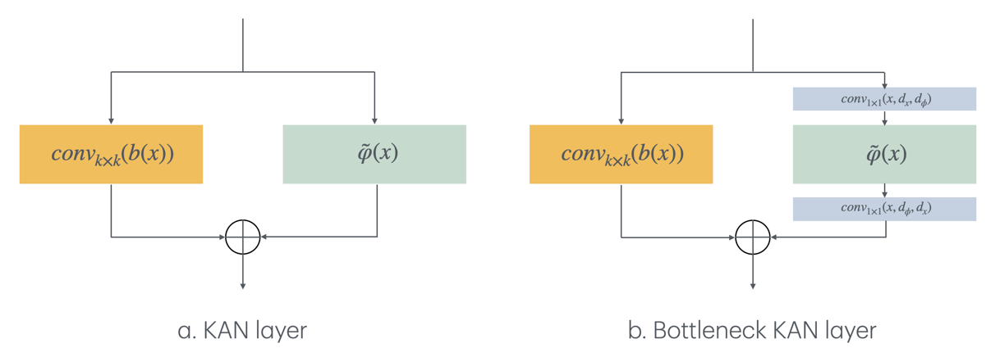

[](https://arxiv.org/abs/2407.01092)

# TorchConv KAN: A Convolutional Kolmogorov-Arnold Networks Collection

This project introduces and demonstrates the training, validation, and quantization of the Convolutional KAN model using PyTorch with CUDA acceleration. The `torch-conv-kan` evaluates performance on the MNIST, CIFAR, TinyImagenet and Imagenet1k datasets.

## Project Status: Under Development
### Updates

- ✅ [2024/05/13] Convolutional KALN layers are available

- ✅ [2024/05/14] Convolutional KAN and Fast KAN layers are available
  
- ✅ [2024/05/15] Convolutional ChebyKAN is available now. MNIST, CIFAR10, and CIFAR100 benchmarks are added.
  
- ✅ [2024/05/19] ResNet-like, U-net like and MoE-based (don't ask why=)) models released with accelerate-based training code.
  
- ✅ [2024/05/21] VGG-like and DenseNet-like models released! Gram KAN convolutional layers added.
  
- ✅ [2024/05/23] WavKAN convolutional layers added. Fixed a bug with the output hook in ```trainer.py```.
  
- ✅ [2024/05/25] U2-net like models added. Fixed a memory leak in ```trainer.py```.

- ✅ [2024/05/27] Updated implementation of WavKAN - much faster now. Added VGG-WavKAN.
  
- ✅ [2024/05/31] Fixed KACN Conv instability issue, added Lion optimizer, updated baseline models and benchmarks, and :fire::fire::fire:**pretrained weights on Imagenet1k are released**:fire::fire::fire:, as well as Imagenet1k training scripts.
  
- ✅ [2024/06/03] JacobiKAN Convs are available now. 
  
- ✅ [2024/06/05] BernsteinKANs and BernsteinKAN Convs are available now. 
  
- ✅ [2024/06/15] Introducing Bottleneck KAN Convs (with Gram polynomials as basis functions for now). Added LBFGS optimizer support (it's not well-tested, please raise an issue if you face any problems with it). Regularization benchmarks on CIFAR 100 are published. Hyperparameters tuning with **Ray Tune** are released.

- ✅ [2024/06/18] ReLU KAN Convs are available now. 
  
- ✅ [2024/06/20] :fire::fire::fire:**New pretrained checkpoint on Imagenet1k are released**:fire::fire::fire: VGG11 style with Bottleneck Gram Convolutions. The model achieves 68.5% Top1 accuracy on Imagenet1k validation set with only 7.25M parameters.

- ✅ [2024/07/02] :fire::fire::fire: We released our paper :fire::fire::fire: [Kolmogorov-Arnold Convolutions: Design Principles and Empirical Studies](https://arxiv.org/abs/2407.01092)

- ✅ [2024/07/09] PEFT code for KAGN models are released, as well as new RDNet-like models, better implementation of Kolmogorov-Arnold-Gram concolutions, and medical images segmentation scripts.

### TODO list and next steps

- Right now VGG19-like model is training on Imagenet1k
- Right now Resnet50-like model is training on Imagenet1k
- Finetuning experiments on other benchmarks are in progress, as well as PEFT methods exploration
- I'm working on pruning and visualization methods as well
---
## Table of content:
 - [Introducing Convolutional KAN layers](#item-one)
 - [Model Zoo](#item-two)
 - [Performance Metrics](#item-three)
 - [Discussion](#item-four)
 - [Usage](#item-five)
 - [Accelerate-based training](#item-six)
 - [Contributions](#item-seven)
 - [Acknowledgements](#item-eight)
 - [References](#item-nine)


<a id="item-one"></a>
## Introducing Convolutional KAN layers

Kolmogorov-Arnold networks rely on Kolmogorov-Arnold representation theorem:


So, from this formula, the authors of [KAN: Kolmogorov-Arnold Networks](https://arxiv.org/abs/2404.19756) derived the new architecture: learnable activations on edges and summation on nodes. MLP in opposite performs fixed non-linearity on nodes and learnable linear projections on edges. 


In a convolutional layer, a filter or a kernel "slides" over the 2D input data, performing an elementwise multiplication. The results are summed up into a single output pixel. The kernel performs the same operation for every location it slides over, transforming a 2D (1D or 3D) matrix of features into a different one. Although 1D and 3D convolutions share the same concept, they have different filters, input data, and output data dimensions. However, we'll focus on 2D for simplicity.

Typically, after a convolutional layer, a normalization layer (like BatchNorm, InstanceNorm, etc.) and non-linear activations (ReLU, LeakyReLU, SiLU, and many more) are applied.

More formal: suppose we have an input image y, with N x N size. We omit the channel axis for simplicity, it adds another summations sign. So, first, we need to convolve it without kernel W with size m x m:


Then, we apply batch norm and non-linearity, for example - ReLU:


Kolmogorov-Arnold Convolutions work slightly differently: the kernel consists of a set of univariate non-linear functions. This kernel "slides" over the 2D input data, performing element-wise application of the kernel's functions. The results are then summed up into a single output pixel. More formal: suppose we have an input image y (again), with N x N size. We omit the channel axis for simplicity, it adds another summations sign. So, the KAN-based convolutions defined as:


And each phi is a univariate non-linear learnable function. In the original paper, the authors propose to use this form of the functions:


And authors propose to choose SiLU as b(x) activation: 


To sum up, the "traditional" convolution is a matrix of weights, while Kolmogorov-Arnold convolutions are a set of functions. That's the primary difference. The key question here is - how should we construct these univariate non-linear functions? The answer is the same as for KANs: B-splines, polynomials, RBFs, Wavelets, etc.

In this repository, the implementation of the following layers is presented:

- The `KANConv1DLayer`, `KANConv2DLayer`, `KANConv3DLayer` classes represent convolutional layers based on the Kolmogorov Arnold Network, introduced in [1]. Baseline model implemented in `models/baselines/conv_kan_baseline.py`.

- The `KALNConv1DLayer`, `KALNConv2DLayer`, `KALNConv3DLayer` classes represent convolutional layers based on the Kolmogorov Arnold Legendre Network, introduced in [2]. Baseline model implemented in `models/baselines/conv_kaln_baseline.py`.

- The `FastKANConv1DLayer`, `FastKANConv2DLayer`, `FastKANConv3DLayer` classes represent convolutional layers based on the Fast Kolmogorov Arnold Network, introduced in [3]. Baseline model implemented in `models/baselines/fast_conv_kan_baseline.py`.

- The `KACNConv1DLayer`, `KACNConv1DLayer`, `KACNConv1DLayer` classes represent convolutional layers based on Kolmogorov Arnold Network with Chebyshev polynomials instead of B-splines, introduced in [4]. Baseline model implemented in `models/baselines/conv_kacn_baseline.py`.

- The `KAGNConv1DLayer`, `KAGNConv1DLayer`, `KAGNConv1DLayer` classes represent convolutional layers based on Kolmogorov Arnold Network with Gram polynomials instead of B-splines, introduced in [5]. Baseline model implemented in `models/baselines/conv_kagn_baseline.py`.

- The `WavKANConv1DLayer`, `WavKANConv1DLayer`, `WavKANConv1DLayer` classes represent convolutional layers based on Wavelet Kolmogorov Arnold Network, introduced in [6]. Baseline model implemented in `models/baselines/conv_wavkan_baseline.py`.

- The `KAJNConv1DLayer`, `KAJNConv2DLayer`, `KAJNConv3DLayer` classes represent convolutional layers based on Jacobi Kolmogorov Arnold Network, introduced in [7] with minor modifications.

- We introduce the `KABNConv1DLayer`, `KABNConv2DLayer`, `KABNConv3DLayer` classes represent convolutional layers based on Bernstein Kolmogorov Arnold Network.

- The `KABNConv1DLayer`, `KABNConv2DLayer`, `KABNConv3DLayer` classes represent convolutional layers based on ReLU KAN, introduced in [8].

### Introducing Bottleneck Convolutional KAN layers

As we previously discussed, a phi function consists of two blocks: residual activation functions (left part of diagrams below) and learnable non-linearity (splines, polynomials, wavelet, etc; right part of diagrams below). 



The main problem is in the right part: the more channels we have in input data, the more learnable parameters we introduce in the model. So, as a Bottleneck layer in ResNets, we could do a simple trick: we can apply 1x1 squeezing convolution to the input data, perform splines in this space, and then apply 1x1 unsqueezing convolution.

Let's assume, we have input **x** with 512 channels, and we want to perform ConvKAN with 512 filters. First, conv 1x1 projects **x** to **y** with 128 channels for example. Now we apply learned non-linearity to y, and last conv 1x1 transforms **y** to **t** with 512 channels (again). Now we can sum **t** with residual activations.

In this repository, the implementation of the following bottleneck layers is presented:

- The `BottleNeckKAGNConv1DLayer`, `BottleNeckKAGNConv2DLayer`, `BottleNeckKAGNConv3DLayer` classes represent bottleneck convolutional layers based on Kolmogorov Arnold Network with Gram polynomials instead of B-splines.

- The `BottleNeckKAGNConv1DLayer`, `BottleNeckKAGNConv2DLayer`, `BottleNeckKAGNConv3DLayer` classes represent bottleneck convolutional layers based on Kolmogorov Arnold Network with Gram polynomials instead of B-splines.

<a id="item-two"></a>
## Model Zoo

### ResKANets

We introduce ResKANets - a ResNet-like model with KAN convolutions instead of regular ones. Main class ```ResKANet``` could be found ```models/densekanet.py```. Our implementation supports blocks with KAN, Fast KAN, KALN, KAGN, and KACN convolutional layers.

After 75 training epochs on CIFAR10 ResKANet 18 with Kolmogorov Arnold Legendre convolutions achieved 84.17% accuracy and 0.985 AUC (OVO).

After 75 training epochs on Tiny Imagenet ResKANet 18 with Kolmogorov Arnold Legendre convolutions achieved 28.62% accuracy, 55.49% top-5 accuracy, and 0.932 AUC (OVO).

Please, take into account that these are preliminary results and more experiments are in progress right now.

### DenseKANets

We introduce DenseKANets - a DenseNet-like model with KAN convolutions instead of regular ones. Main class ```DenseKANet``` could be found ```models/reskanet.py```. Our implementation supports blocks with KAN, Fast KAN, KALN, KAGN, and KACN convolutional layers.

After 250 training epochs on Tiny Imagenet DenseNet 121 with Kolmogorov Arnold Gram convolutions achieved 40.61% accuracy, 65.08% top-5 accuracy, and 0.957 AUC (OVO).

Please, take into account that these are preliminary results and more experiments are in progress right now.

### VGGKAN

We introduce VGGKANs - an VGG-like models with KAN convolutions instead of regular ones. Main class ```VGG``` could be found ```models/vggkan.py```. The model supports all types of KANs Convolutional layers.

Pretrained on Imagenet1k ckeckpoints:

| Model | Accuracy, top1 | Accuracy, top5 | AUC (ovo) | AUC (ovr) |
|:--------------:|:--------------:|:--------------:|:---------:|:---------:|
| [VGG KAGN 11v2](https://huggingface.co/brivangl/vgg_kagn11_v2)|      59.1      |      82.29     |   99.43   |   99.43   |
| [VGG KAGN 11v4](https://huggingface.co/brivangl/vgg_kagn11_v4)|     61.17     |      83.26     |   99.42   |   99.43   |
| [VGG KAGN BN 11v4](https://huggingface.co/brivangl/vgg_kagn_bn11_v4)|    68.5      |      88.46     |   99.61   |   99.61  |

More checkpoints are coming, stay tuned. Available for me computational resources are pretty limited, so it takes some time to train and eval all models.

### UKANet and U2KANet

We introduce UKANets and U2KANets - a U-net-like model with KAN convolutions instead of regular ones, based on resnet blocks, and U2-net with KAN Convolutions instead of regular ones. Main class ```UKANet``` could be found ```models/ukanet.py```. Our implementation supports Basic and Bottleneck blocks with KAN, Fast KAN, KALN, KAGC, and KACN convolutional layers.

<a id="item-three"></a>
## Performance Metrics

[Baseline models on MNIST and CIFAR10/100](./reports/mnist_cifar_baseline.md) TL;DR: 8 layer SimpleKAGNConv achieves 99.68 accuracy on MNIST, 84.32 on CIFAR 10 and 59.27 on CIFAR100. It's the best model on all datasets, except CIFAR10: 8-layer SimpleWavKANConv achieves 85.37 accuracy on CIFAR10.


[VGG-like on Imagenet1k](./reports/imagenet1k-vggs.md)


[Regularization, scaling and hyperparameter optimization study](./reports/cifar_100_regularization.md) TL;DR 8 layer SimpleKAGNConv 74.87% accuracy on CIFAR100 with optimal set of params.

<a id="item-four"></a>
## Discussion

First and foremost, it should be noted that the results obtained are preliminary. The model architecture has not been thoroughly explored and represents only two of many possible design variants.

Nevertheless, the experiments indicate that Kolmogorov-Arnold convolutional networks outperform the classical convolutional architecture on the MNIST dataset, but significantly underperform on CIFAR-10 and CIFAR-100 in terms of quality. The ChebyKAN-based convolution encounters stability issues during training, necessitating further investigation.

As a next step, I plan to search for a suitable architecture for KAN convolutions that can achieve acceptable quality on CIFAR-10/100 and attempt to scale these models to more complex datasets.

## Prerequisites

Ensure you have the following installed on your system:

- Python (version 3.9 or higher)
- CUDA Toolkit (corresponding to your PyTorch installation's CUDA version)
- cuDNN (compatible with your installed CUDA Toolkit)

<a id="item-five"></a>
## Usage

Below is an example of a simple model based on KAN convolutions:
```python
import torch
import torch.nn as nn

from kan_convs import KANConv2DLayer


class SimpleConvKAN(nn.Module):
    def __init__(
            self,
            layer_sizes,
            num_classes: int = 10,
            input_channels: int = 1,
            spline_order: int = 3,
            groups: int = 1):
        super(SimpleConvKAN, self).__init__()

        self.layers = nn.Sequential(
            KANConv2DLayer(input_channels, layer_sizes[0], spline_order, kernel_size=3, groups=1, padding=1, stride=1,
                           dilation=1),
            KANConv2DLayer(layer_sizes[0], layer_sizes[1], spline_order, kernel_size=3, groups=groups, padding=1,
                           stride=2, dilation=1),
            KANConv2DLayer(layer_sizes[1], layer_sizes[2], spline_order, kernel_size=3, groups=groups, padding=1,
                           stride=2, dilation=1),
            KANConv2DLayer(layer_sizes[2], layer_sizes[3], spline_order, kernel_size=3, groups=groups, padding=1,
                           stride=1, dilation=1),
            nn.AdaptiveAvgPool2d((1, 1))
        )

        self.output = nn.Linear(layer_sizes[3], num_classes)

        self.drop = nn.Dropout(p=0.25)

    def forward(self, x):
        x = self.layers(x)
        x = torch.flatten(x, 1)
        x = self.drop(x)
        x = self.output(x)
        return x
```

To run the training and testing of the baseline models on the MNIST, CIFAR-10, and CIFAR-100 datasets, execute the following line of code:

```python mnist_conv.py```

This script will train baseline models on MNIST, CIFAR10 or CIFAR100, validate them, quantise and log performance metrics.

<a id="item-six"></a>
### Accelerate-based training

We introduce training code with Accelerate, Hydra configs and Wandb logging. 

#### 1. Clone the Repository

Clone the `torch-conv-kan` repository and set up the project environment:

```bash
git clone https://github.com/IvanDrokin/torch-conv-kan.git
cd torch-conv-kan
pip install -r requirements.txt
```

#### 2. Configure Weights & Biases (wandb)

To monitor experiments and model performance with wandb:

1. **Set Up wandb Account:**

- Sign up or log in at [Weights & Biases](https://wandb.ai).
- Locate your API key in your account settings.

2. **Initialize wandb in Your Project:**

Before running the training script, initialize wandb:

```python
wandb login
```

Enter your API key when prompted to link your script executions to your wandb account.

3. **Adjust the Entity Name in `configs/cifar10-reskanet.yaml` or `configs/tiny-imagenet-reskanet.yaml` to Your Username or Team Name**

#### Run

Update any parameters in configs and run

```python
accelerate launch cifar.py
```

This script trains the model, validates it, and logs performance metrics using wandb on the CIFAR10 dataset.

```python
accelerate launch tiny_imagenet.py
```

This script trains the model, validates it, and logs performance metrics using wandb on the Tiny Imagenet dataset.

### Using your own dataset or model

If you would like to use your own dataset, please follow these steps:

1. Copy ```tiny_imagenet.py``` and modify ```get_data()``` method. If the basic implementation of the Classification dataset is not suitable for your data - please, upgrade it or write your one.
2. Replace ```model = reskalnet_18x64p(...)``` with your own one if necessary.
3. Create config yaml in ```config```folders, following provided templates.
4. Run ```accelerate launch your_script.py```

## Cite this Project

If you use this project in your research or wish to refer to the baseline results, please use the following BibTeX entry.

```bibtex
@misc{drokin2024kolmogorovarnoldconvolutionsdesignprinciples,
      title={Kolmogorov-Arnold Convolutions: Design Principles and Empirical Studies}, 
      author={Ivan Drokin},
      year={2024},
      eprint={2407.01092},
      archivePrefix={arXiv},
      primaryClass={cs.CV},
      url={https://arxiv.org/abs/2407.01092}, 
}
```
<a id="item-seven"></a>
## Contributions

Contributions are welcome. Please raise issues as necessary.
<a id="item-eight"></a>
## Acknowledgements

This repository based on [TorchKAN](https://github.com/1ssb/torchkan/), [FastKAN](https://github.com/ZiyaoLi/fast-kan), [ChebyKAN](https://github.com/SynodicMonth/ChebyKAN), [GRAMKAN](https://github.com/Khochawongwat/GRAMKAN), [WavKAN](https://github.com/zavareh1/Wav-KAN), [JacobiKAN](https://github.com/SpaceLearner/JacobiKAN), and [ReLU KAN](https://github.com/quiqi/relu_kan). And we would like to say thanks for their open research and exploration.

<a id="item-nine"></a>
## References

- [1] Ziming Liu et al., "KAN: Kolmogorov-Arnold Networks", 2024, arXiv. https://arxiv.org/abs/2404.19756
- [2] https://github.com/1ssb/torchkan
- [3] https://github.com/ZiyaoLi/fast-kan
- [4] https://github.com/SynodicMonth/ChebyKAN
- [5] https://github.com/Khochawongwat/GRAMKAN
- [6] https://github.com/zavareh1/Wav-KAN  
- [7] https://github.com/SpaceLearner/JacobiKAN
- [8] https://github.com/quiqi/relu_kan
- [9] https://github.com/KindXiaoming/pykan
- [10] https://github.com/Blealtan/efficient-kan

## Star History

<a href="https://star-history.com/#IvanDrokin/torch-conv-kan&Date">
 <picture>
   <source media="(prefers-color-scheme: dark)" srcset="https://api.star-history.com/svg?repos=IvanDrokin/torch-conv-kan&type=Date&theme=dark" />
   <source media="(prefers-color-scheme: light)" srcset="https://api.star-history.com/svg?repos=IvanDrokin/torch-conv-kan&type=Date" />
   
 </picture>
</a>
