# Regularization study, CIFAR100

## Isolated experiments

Baseline model was chosen to be simple networks with 8 convolutional layers with Gram polynomials as basis functions. To reduce dimensionality, convolutions with dilation=2 were used: the second, third, and sixth convolutions had dilation=2.

We explore two sets of convolutional layers filters:

**Slim**: 16, 32, 64, 128, 256, 256, 512, 512

**Wide**: 32, 64, 128, 256, 512, 512, 1024, 1024

After the convolutions, Global Average Pooling was applied, followed by a linear output layer. In these experiments, a dropout after Global Pooling hasn't been used.

Augmentations have been used:
```python
from torchvision.transforms import v2
from torchvision.transforms.autoaugment import AutoAugmentPolicy

transform_train = v2.Compose([

            v2.RandomHorizontalFlip(p=0.5),
            v2.RandomChoice([v2.AutoAugment(AutoAugmentPolicy.CIFAR10),
                             v2.AutoAugment(AutoAugmentPolicy.IMAGENET),
                             v2.AutoAugment(AutoAugmentPolicy.SVHN),
                             v2.TrivialAugmentWide()]),
            v2.ToTensor(),
            v2.Normalize((0.5,), (0.5,))
        ])
```

All experiments were conducted on an NVIDIA RTX 3090 with identical training parameters.

As part of this research, we aim to find answers to the following questions:

- What is the impact of L1 and L2 activation penalties of ConvKAN layers on the model?

- What is the impact of L1 regularization of the weights of ConvKAN layers on the model?

- What is the impact of the placement of dropout within a ConvKAN layer on the model? Essentially, there are three placements: before the layer (Full), before the calculation of the polynomial basis (Poly), and before applying the weights to the calculated polynomials (Degree).

- Since KAN models are supposed to be more robust to noise in the data, can we replace the Dropout layer with additive Gaussian noise as regularization technique?

### Noise Injection

Here is the code for ```NoiseInjection``` layer:

```python
import torch
import torch.nn as nn


class NoiseInjection(nn.Module):
    def __init__(self, p: float = 0.0, alpha: float = 0.05):
        super(NoiseInjection, self).__init__()
        self.p = p
        self.alpha = alpha

    def get_noise(self, x):
        std = torch.std(x, dim=1, keepdim=True)
        noise = torch.randn(x.shape, device=x.device, dtype=x.dtype) * std
        return noise

    def forward(self, x):
        if self.training:
            mask = torch.rand(x.shape, device=x.device, dtype=x.dtype)
            mask = (mask < self.p).float() * 1
            x = x + self.alpha * mask * self.get_noise(x)
            return x
        return x
```

### Slim model
#### L1 and L2 activation penalties

|Train Accuracy|Val. Accuracy|   Regularization   |
|--------------|-------------|--------------------|
|     73.73    |    61.30    |        None        |
|     74.49    |    61.20    |L1 Activation, 1e-08|
|     74.64    |    61.41    |L1 Activation, 1e-07|
|     74.11    |  **61.74**  |L1 Activation, 1e-06|
|     73.85    |    61.36    |L2 Activation, 1e-08|
|     73.96    |    61.55    |L2 Activation, 1e-07|
|     73.10    |    60.29    |L2 Activation, 1e-06|

Here is training and validation accuracy during training, L1 activation penalty.
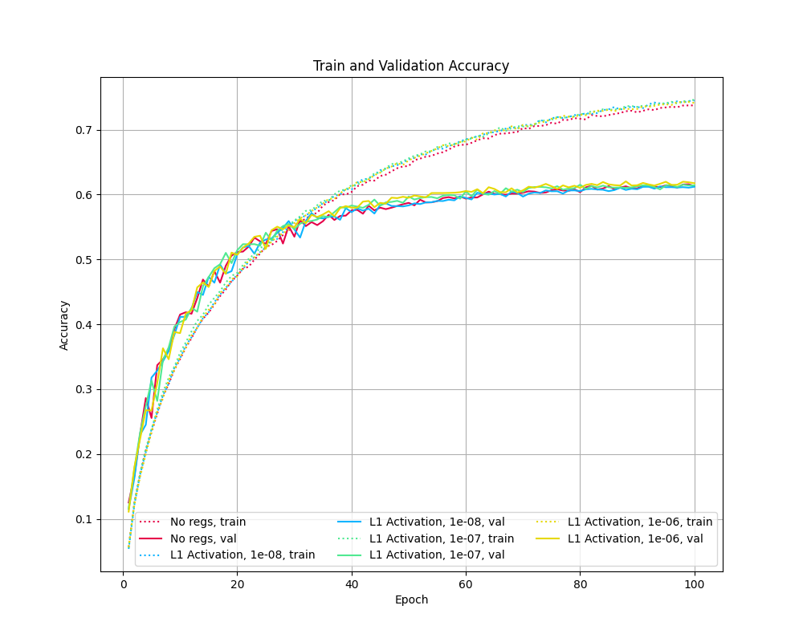

Here is training and validation accuracy during training, L2 activation penalty.
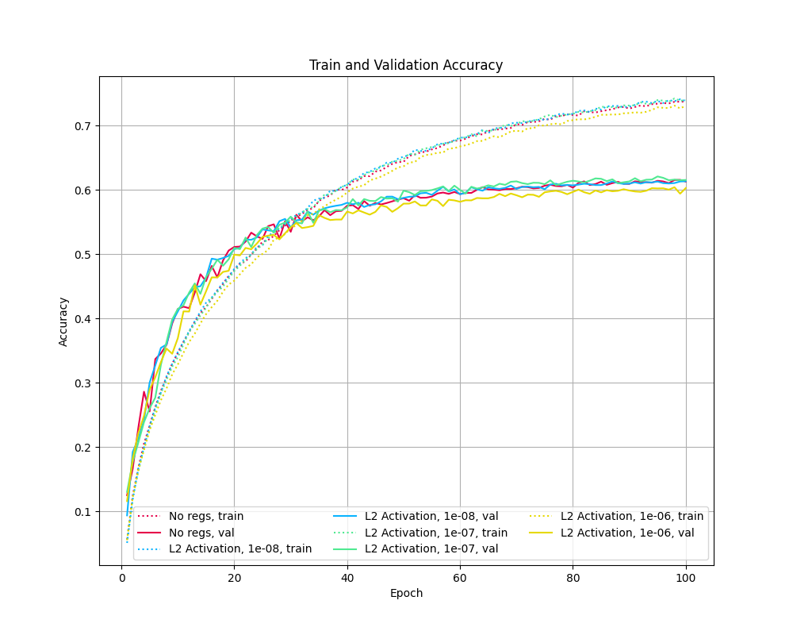

#### L1 weight regularization

|Train Accuracy|Val. Accuracy| Regularization |
|--------------|-------------|----------------|
|     73.73    |    61.30    |      None      |
|     74.31    |  **61.39**  |L1 Weight, 1e-08|
|     73.48    |    61.08    |L1 Weight, 1e-07|
|     73.60    |    60.96    |L1 Weight, 1e-06|

Here is training and validation accuracy during training, L1 weight regularization.
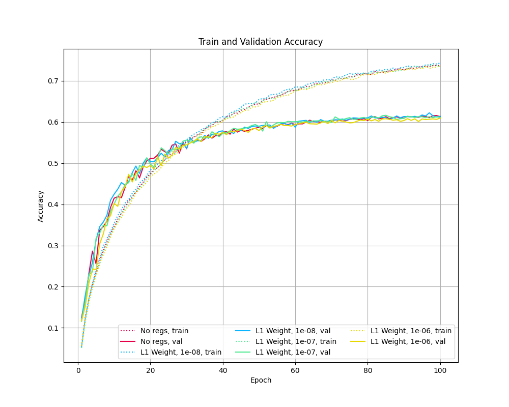

#### Dropout

|Train Accuracy|Val. Accuracy|   Regularization   |
|--------------|-------------|--------------------|
|     73.73    |    61.30    |        None        |
|     68.69    |    60.98    | Poly Dropout, 0.05 |
|     60.98    |  **63.64**  | Full Dropout, 0.05 |
|     70.12    |    62.91    |Degree Dropout, 0.05|
|     65.43    |    58.63    | Poly Dropout, 0.15 |
|     43.77    |    56.10    | Full Dropout, 0.15 |
|     64.37    |    62.28    |Degree Dropout, 0.15|
|     61.93    |    51.27    | Poly Dropout, 0.25 |
|     32.99    |    47.65    | Full Dropout, 0.25 |
|     60.09    |    60.69    |Degree Dropout, 0.25|

Here is training and validation accuracy during training, dropouts.
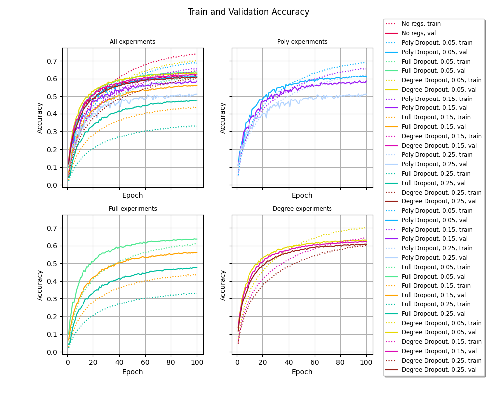

#### Noise Injection

|Train Accuracy|Val. Accuracy|       Regularization       |
|--------------|-------------|----------------------------|
|     73.73    |    61.30    |            None            |
|     70.42    |    62.06    | Poly Noise Injection, 0.05 |
|     59.75    |  **62.63**  | Full Noise Injection, 0.05 |
|     69.45    |    62.40    |Degree Noise Injection, 0.05|
|     65.75    |    57.64    | Poly Noise Injection, 0.15 |
|     43.78    |    56.15    | Full Noise Injection, 0.15 |
|     64.52    |    61.78    |Degree Noise Injection, 0.15|
|     63.38    |    53.14    | Poly Noise Injection, 0.25 |
|     33.54    |    48.24    | Full Noise Injection, 0.25 |
|     60.17    |    60.98    |Degree Noise Injection, 0.25|

Here is training and validation accuracy during training, noise injection.
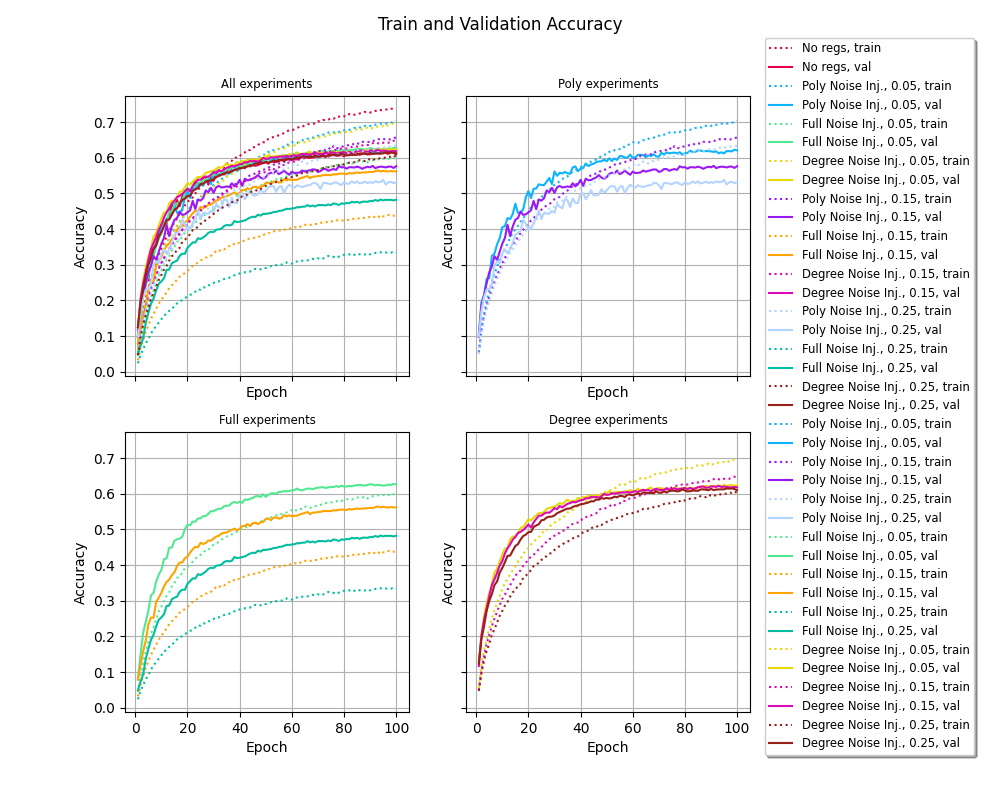

### Wide model
#### L1 and L2 activation penalties

|Train Accuracy|Val. Accuracy|   Regularization   |
|--------------|-------------|--------------------|
|     86.88    |    67.04    |        None        |
|     86.69    |    66.41    |L1 Activation, 1e-08|
|     86.60    |    66.88    |L1 Activation, 1e-07|
|     86.73    |    67.09    |L1 Activation, 1e-06|
|     86.61    |  **67.49**  |L2 Activation, 1e-08|
|     86.78    |    66.81    |L2 Activation, 1e-07|
|     86.99    |    66.30    |L2 Activation, 1e-06|

Here is training and validation accuracy during training, L1 activation penalty.
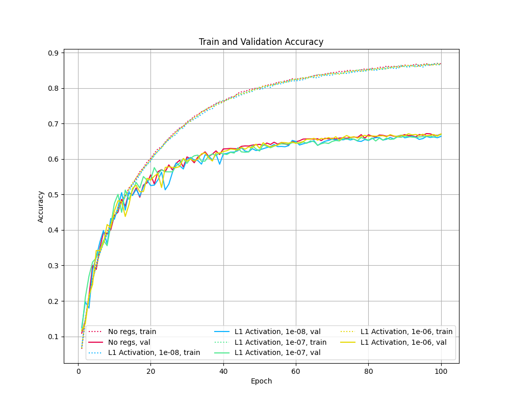

Here is training and validation accuracy during training, L2 activation penalty.
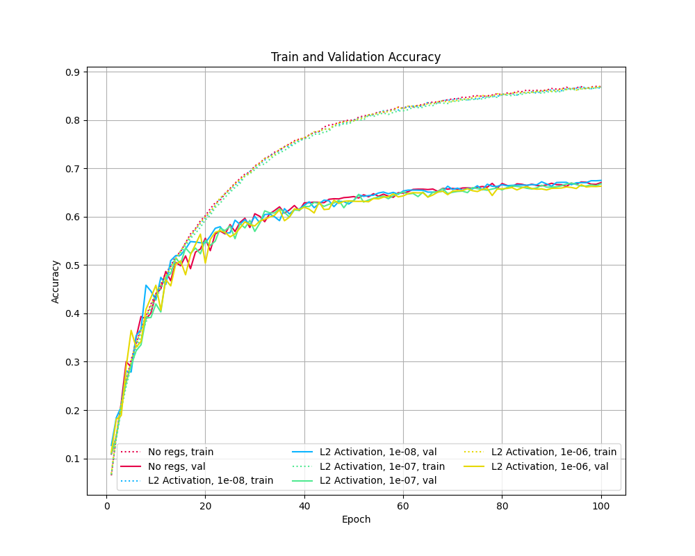

#### L1 weight regularization
|Train Accuracy|Val. Accuracy| Regularization |
|--------------|-------------|----------------|
|     86.88    |    67.04    |      None      |
|     86.41    |    66.79    |L1 Weight, 1e-08|
|     86.68    |  **67.23**  |L1 Weight, 1e-07|
|     87.10    |    66.83    |L1 Weight, 1e-06|

Here is training and validation accuracy during training, L1 weight regularization.
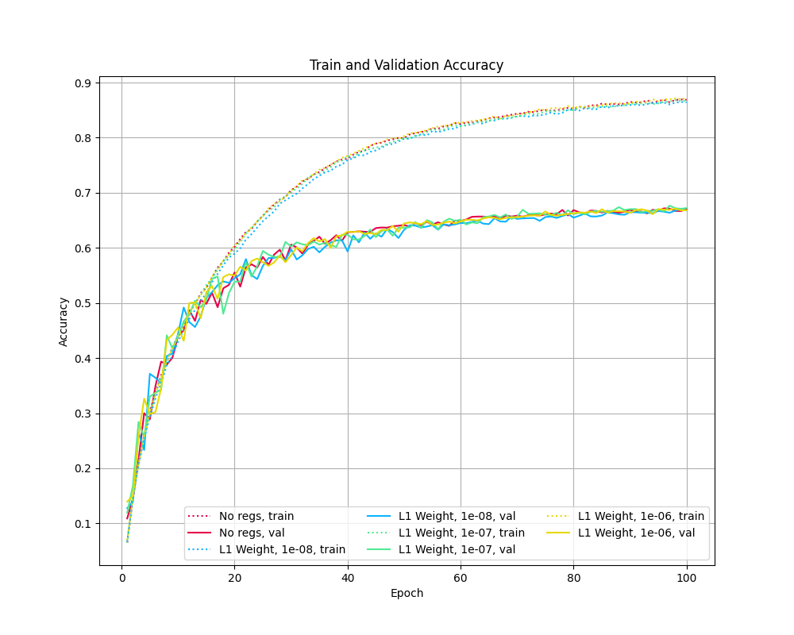

#### Dropout
|Train Accuracy|Val. Accuracy|   Regularization   |
|--------------|-------------|--------------------|
|     86.88    |    67.04    |        None        |
|     84.97    |    66.83    | Poly Dropout, 0.05 |
|     79.53    |  **68.93**  | Full Dropout, 0.05 |
|     85.01    |    67.75    |Degree Dropout, 0.05|
|     82.07    |    62.26    | Poly Dropout, 0.15 |
|     63.19    |    66.38    | Full Dropout, 0.15 |
|     81.24    |    68.70    |Degree Dropout, 0.15|
|     80.22    |    59.70    | Poly Dropout, 0.25 |
|     49.49    |    59.56    | Full Dropout, 0.25 |
|     77.46    |    67.85    |Degree Dropout, 0.25|

Here is training and validation accuracy during training, dropouts.
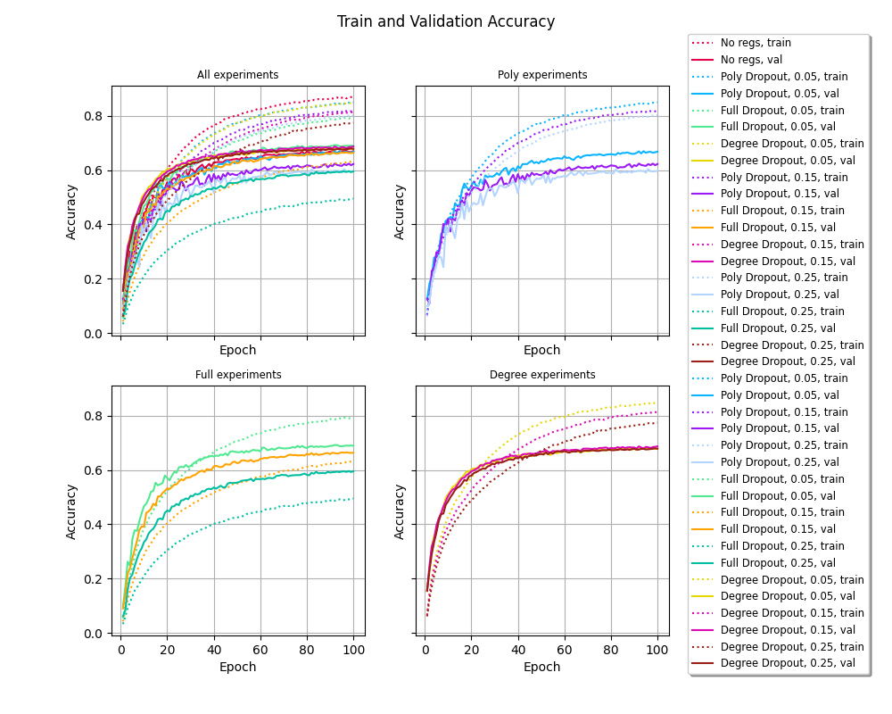

#### Noise Injection
|Train Accuracy|Val. Accuracy|       Regularization       |
|--------------|-------------|----------------------------|
|     86.88    |    67.04    |            None            |
|     84.65    |    67.11    | Poly Noise Injection, 0.05 |
|     79.71    |  **69.18**  | Full Noise Injection, 0.05 |
|     85.00    |    68.43    |Degree Noise Injection, 0.05|
|     82.78    |    63.82    | Poly Noise Injection, 0.15 |
|     63.30    |    66.07    | Full Noise Injection, 0.15 |
|     81.33    |    68.23    |Degree Noise Injection, 0.15|
|     80.74    |    59.96    | Poly Noise Injection, 0.25 |
|     49.58    |    59.70    | Full Noise Injection, 0.25 |
|     77.26    |    67.82    |Degree Noise Injection, 0.25|

Here is training and validation accuracy during training, noise injection.
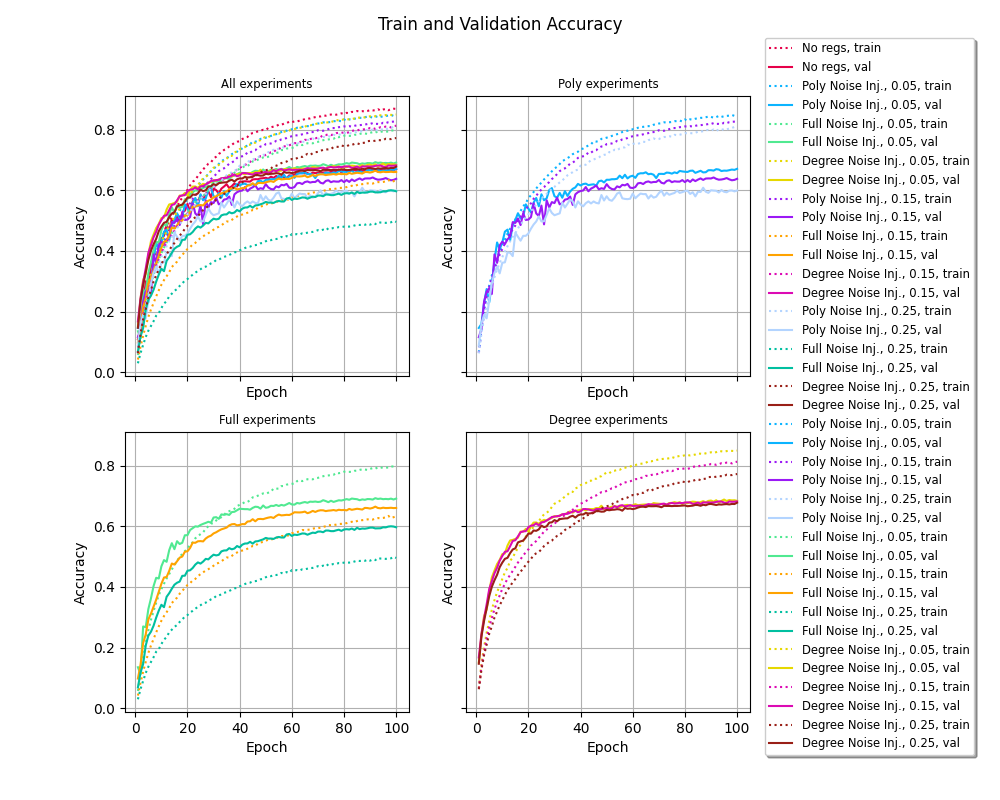

## Discussion

Based on the conducted experiments, the following conclusions can be drawn:

 - It seems that Full Dropout and Full Noise Injection are the best options for regularization, helping to combat model overfitting.
 - L1/L2 activation penalties, as well as L1 weight penalty, slightly improve the situation, but not significantly.
 - In a wider model, the impact of regularization is greater.

## Scaling
Let’s talk about scaling. In classical convolutional networks, we have two major options for scaling up models: we can go deeper and stack more layers, or we can go wider and expand the number of convolutional filters. There are other ways to scale up models, like leveraging a mixture of experts, but we wouldn’t focus on them today.

KAN Convs with Gram polynomials as basis functions provide us with another possibility for scaling: instead of inflating channel numbers or adding new layers, we could increase the degree of polynomials.

So, we are going to train a set of networks with different widths, depths, and degrees. 

During the experiments, we used the same augmentations as in the previous section, NoiseInjection in Full positions for regularization with p = 0.05 and linear dropout with p = 0.05.

|Train Accuracy|Val. Accuracy| model|degree|width_scale|Parameters|
|--------------|-------------|------|------|-----------|----------|
|     58.15    |    56.35    |  16  |   7  |     2     |  382.25M |
|     44.28    |    50.07    |  16  |   7  |     1     |  95.59M  |
|     57.35    |    55.72    |  16  |   5  |     2     |  297.33M |
|     43.27    |    50.94    |  16  |   5  |     1     |  74.36M  |
|     56.34    |    58.09    |  16  |   3  |     2     |  212.41M |
|     42.91    |    51.48    |  16  |   3  |     1     |  53.13M  |
|     80.70    |    65.42    |  12  |   7  |     2     |  438.90M |
|     74.71    |    63.81    |  12  |   7  |     1     |  109.76M |
|     84.31    |    67.31    |  12  |   5  |     2     |  341.39M |
|     75.96    |    64.47    |  12  |   5  |     1     |  85.38M  |
|     82.06    |  **69.70**  |  12  |   3  |     2     |  243.88M |
|     73.14    |    66.65    |  12  |   3  |     1     |  61.00M  |
|     84.89    |    66.64    |   8  |   7  |     2     |  162.85M |
|     73.53    |    62.93    |   8  |   7  |     1     |  40.74M  |
|     83.96    |    67.94    |   8  |   5  |     2     |  126.69M |
|     70.36    |    64.01    |   8  |   5  |     1     |  31.70M  |
|     81.41    |    69.67    |   8  |   3  |     2     |  90.52M  |
|     65.24    |    65.30    |   8  |   3  |     1     |  22.66M  |

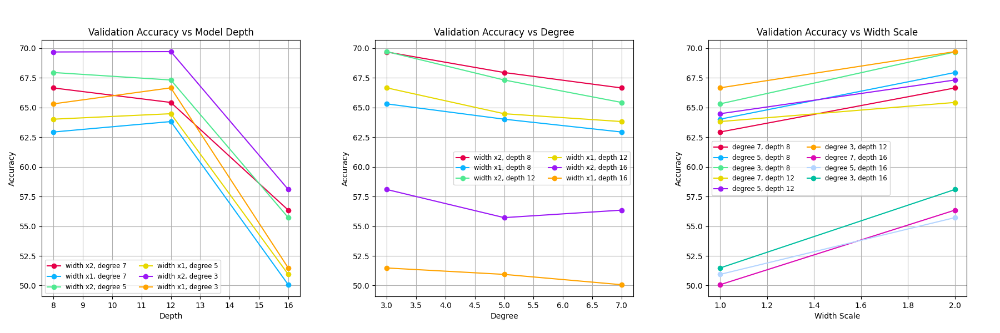

Interesting conclusions:

 - Seems that scaling width works better than scaling depth. 
 - There are no benefits of scaling degree
 - Number of trainable params grows really fast in any setup (depth, width or degree)

It could be linked with small dataset size and maybe on larger datasets we will see another results. Anyway, we need to find a workaround for that.

## Hyper parameters tuning

In this experiment, we want to try to find a good set of hyperparameters for 8 layers models. Search space consists of:

- L1 activation penalty
- L2 activation penalty
- L1 weight decay
- Dropout rate before the output layer
- Dropout rate/Noise Injection, Full placement
- “Dropout type”: use either Dropout or Noise Injection inside ConvKAGN layers
- Width scale: parameter that expands the number of channels
- Degree of Gram polynomials
- Adam weights decay
- Learning rate
- Learning rate power: parameter that controls the learning rate scheduler
- Label smoothing

In order to find a proper parameter set and reduce the probability of overfitting to the test set, we split the training set of CIFAR100 into new train and new test sets with a proportion of 80/20. After finishing the parameter search, we train the new model on the full CIFAR100 training set and evaluate it on the full test set.

After 50 runs of optimization, the following best parameters have been acquired with an accuracy of 61.85%:

```json
{
    'l1_activation_penalty': 1e-07,
    'l2_activation_penalty': 1e-06,
    'l1_decay': 0,
    'dropout_linear': 0.1456351951990277,
    'dropout_full': 0.08211066335714672,
    'drop_type': 'noise',
    'width_scale': 6,
    'degree': 3,
    'lr_power': 1.1275350538654738,
    'adam_weight_decay': 6.579785489783022e-06,
    'learning_rate': 0.000779538356958937,
    'label_smoothing': 0.1823706816166831
}
```
And the results of the models on this parameter set.

|Val. Accuracy| Model|Parameters|
|-------------|------|----------|
|  **74.87**  |  8   |  203.59M |
|    72.48    |  12  |  389.39M |
|    67.28    |  16  |  477.83M |

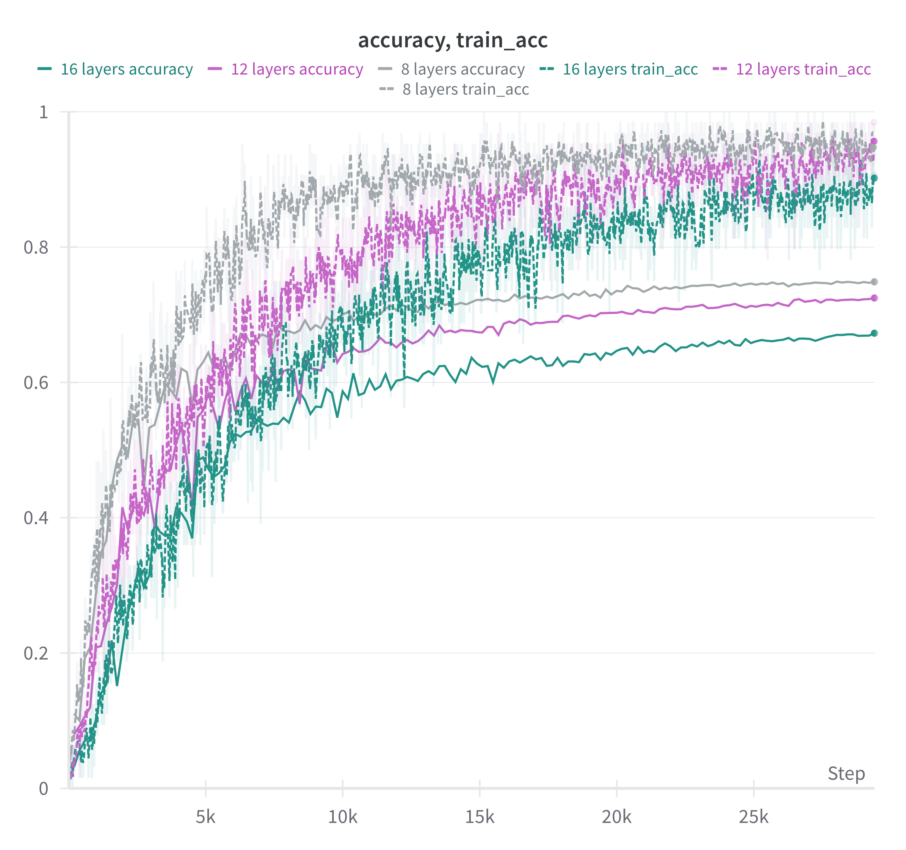

The model trained on optimal parameters performs much better compared to the default one. We also see that depth increasing negatively affects performance, it could be linked to extreme model size (almost half a billion params) or with extreme depth and vanishing gradients, but we have a lot of workarounds for that case: ResNet-like, DenseNet-like, and many other ways to deal with it. All we need to do is solve the overwhelming parameter number in the models. 

## Conclusions

A good set of training parameters for the 8-layer ConvKAN model that boosts performance on CIFAR100 to an amazing 74.87% accuracy. Interesting fact, Noise Injection works better compared to Dropout for KANs.

But there are several problems:

- The number of parameters in the model is too large and grows too quickly with an increase in the model's width or depth.

- This leads to very long training times and increased resource consumption.

- This is likely related to the model's poor scalability in depth - the probability of overfitting is very high.

- Or maybe it’s better to scale KANs widthwise instead of depthwise. intuitively, KAN convolutional kernels are a set of learnable non-linear functions, and these functions could be pretty complex to handle dataset patterns with fewer layers compared to traditional convolutions. 