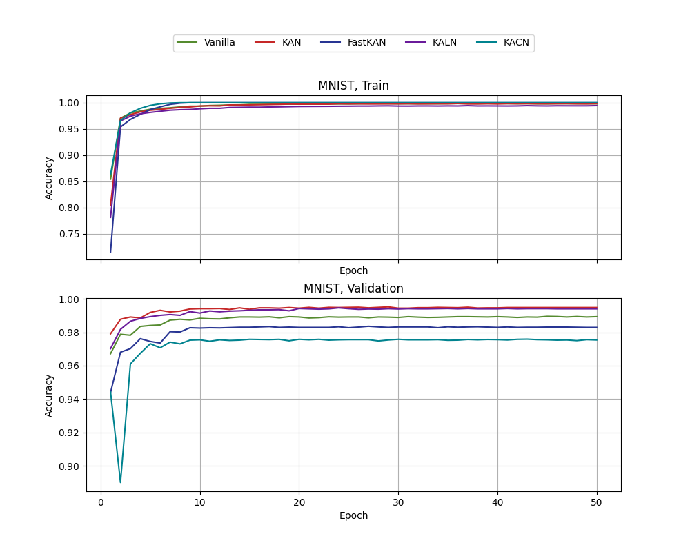
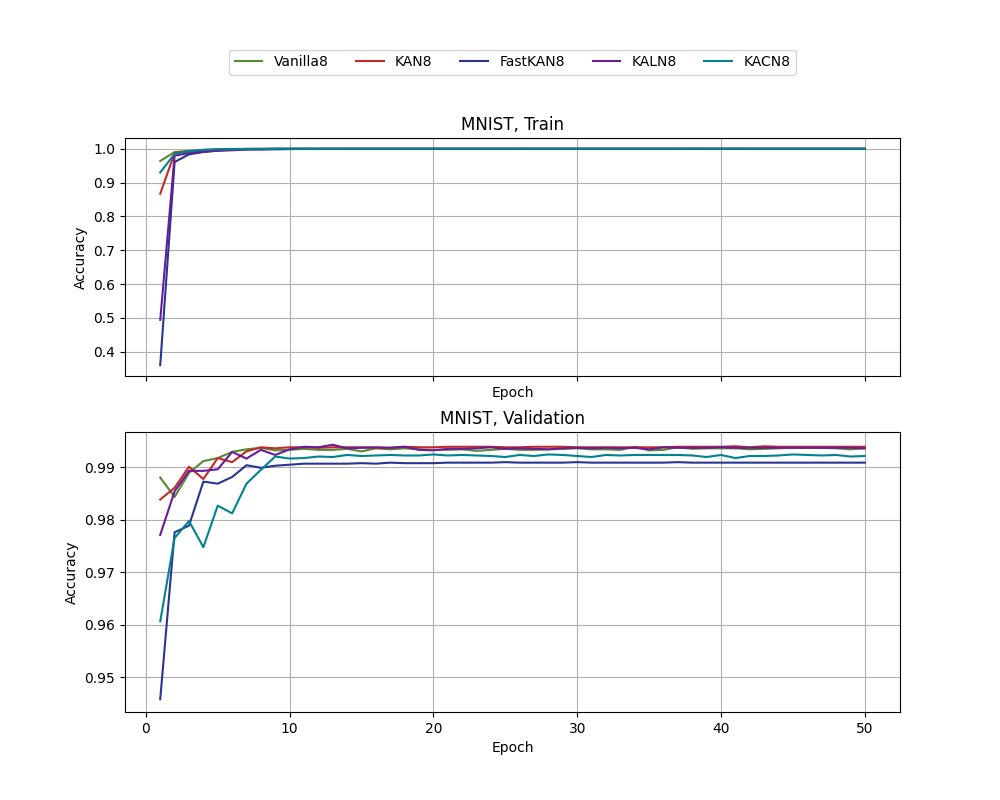
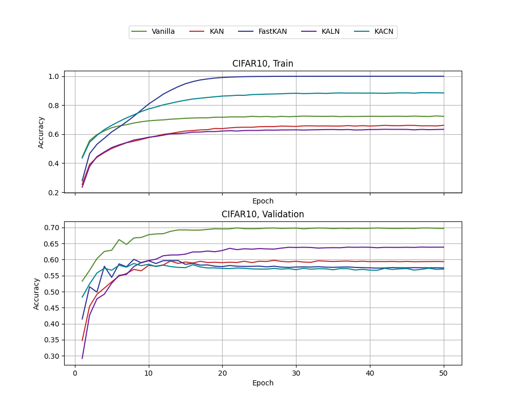
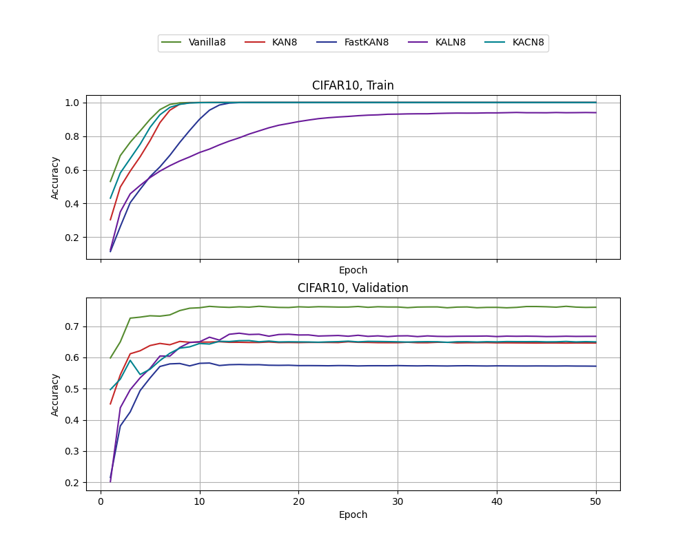
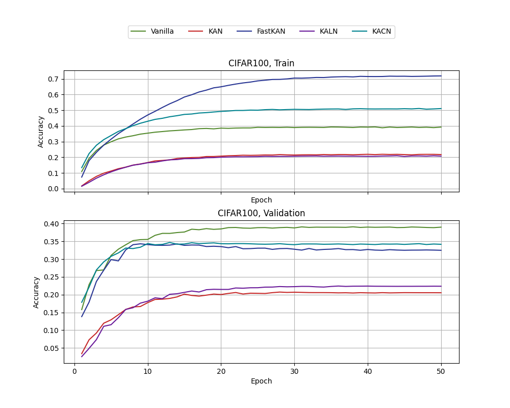
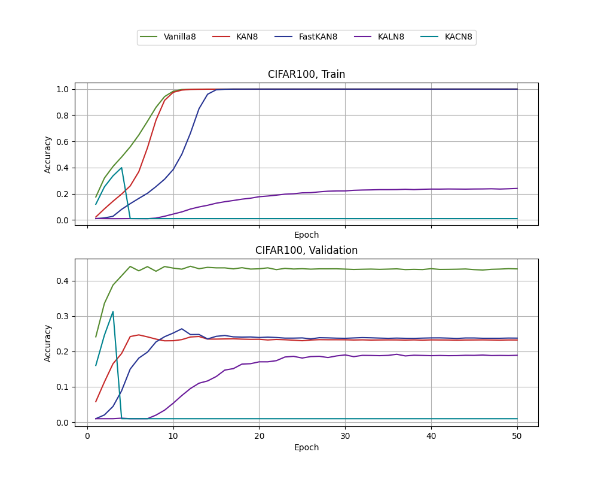

# Baseline models on MNIST and CIFAR10/100

## Preliminary study

Baseline models were chosen to be simple networks with 4 and 8 convolutional layers. To reduce dimensionality, convolutions with dilation=2 were used. In the 4-layer model, the second and third convolutions had dilation=2, while in the 8-layer model, the second, third, and sixth convolutions had dilation=2.

The number of channels in the convolutions was the same for all models:

For 4 layers: 32, 64, 128, 512
For 8 layers: 2, 64, 128, 512, 1024, 1024, 1024, 1024
After the convolutions, Global Average Pooling was applied, followed by a linear output layer.

In the case of classic convolutions, a traditional structure was used: convolution - batch normalization - ReLU.

All experiments were conducted on an NVIDIA RTX 3090 with identical training parameters. For more details, please refer to the file ```mnist_conv.py```.

### MNIST
Accuracy on the training and validation MNIST datasets, 4 convolutional layer models


Accuracy on the training and validation MNIST datasets, 8 convolutional layer models


| Model                       | Val. Accuracy | Parameters | Eval Time, s |
|-----------------------------|---------------|------------|--------------|
| SimpleConv, 4 layers        | 98.94         | 178122     | 0.4017       |
| SimpleKANConv, 4 layers     | **99.48**     | 1542199    | 1.7437       |
| SimpleFastKANConv, 4 layers | 98.29         | 1542186    | 0.4558       |
| SimpleKALNConv, 4 layers    | 99.40         | 859050     | 0.5085       |
| SimpleKACNConv, 4 layers    | 97.54         | 689738     | 0.4225       |
| SimpleKAGNConv, 4 layers    | 98.01         | 859066     | 0.4541       |
| SimpleConv, 8 layers        | 99.37         | 42151850   | 1.7582       |
| SimpleKANConv, 8 layers     | 99.39         | 75865159   | 5.7914       |
| SimpleFastKANConv, 8 layers | 99.09         | 75865130   | 2.4105       |
| SimpleKALNConv, 8 layers    | 99.36         | 42151850   | 1.7582       |
| SimpleKACNConv, 8 layers    | 99.22         | 33733194   | 0.8509       |
| SimpleKAGNConv, 8 layers    | 99.37         | 42151882   |   1.6168     |

### CIFAR10
Accuracy on the training and validation CIFAR10 datasets, 4 convolutional layer models


Accuracy on the training and validation CIFAR10 datasets, 4 convolutional layer models


|           Model           |Val. Accuracy|Parameters|Eval Time, s|
|---------------------------|-------------|----------|------------|
|    SimpleConv, 4 layers   |    69.69    |  178698  |   0.5481   |
|  SimpleKANConv, 4 layers  |    59.37    |  1547383 |   2.2969   |
|SimpleFastKANConv, 4 layers|    57.39    |  1547370 |   0.6169   |
|  SimpleKALNConv, 4 layers |    63.86    |  861930  |   0.6824   |
|  SimpleKACNConv, 4 layers |    57.03    |  692042  |   0.5853   |
|  SimpleKAGNConv, 4 layers |    50.31    |  861946  |   0.6559   |
|    SimpleConv, 8 layers   |  **76.08**  |  8453642 |   0.5647   |
|  SimpleKANConv, 8 layers  |    64.62    | 75870343 |   7.0329   |
|SimpleFastKANConv, 8 layers|    57.21    | 75870314 |   2.7723   |
|  SimpleKALNConv, 8 layers |    66.77    | 42154730 |   1.9057   |
|  SimpleKACNConv, 8 layers |    64.98    | 33735498 |   0.9085   |
|  SimpleKAGNConv, 8 layers |    65.87    | 42154762 |   1.7415   |

### CIFAR100
Accuracy on the training and validation CIFAR100 datasets, 4 convolutional layer models


Accuracy on the training and validation CIFAR100 datasets, 8 convolutional layer models


|           Model           |Val. Accuracy|Parameters|Eval Time, s|
|---------------------------|-------------|----------|------------|
|    SimpleConv, 4 layers   |    38.99    |  224868  |   0.5533   |
|  SimpleKANConv, 4 layers  |    20.53    |  1593553 |   2.3098   |
|SimpleFastKANConv, 4 layers|    32.48    |  1593540 |   0.6175   |
|  SimpleKALNConv, 4 layers |    22.36    |  908100  |   0.6540   |
|  SimpleKACNConv, 4 layers |    34.17    |  738212  |   0.5820   |
|  SimpleKAGNConv, 4 layers |    11.77    |  908116  |   0.6247   |
|    SimpleConv, 8 layers   |  **43.32**  |  8545892 |   0.5663   |
|  SimpleKANConv, 8 layers  |    23.22    | 75962593 |   7.0452   |
|SimpleFastKANConv, 8 layers|    23.75    | 75962564 |   2.7713   |
|  SimpleKALNConv, 8 layers |    18.90    | 42246980 |   1.8955   |
|  SimpleKACNConv, 8 layers |     0.98    | 33827748 |   0.9093   |
|  SimpleKAGNConv, 8 layers |    19.42    | 42247012 |   1.7440   |

## Updated baseline

Baseline models were chosen to be simple networks with 4 and 8 convolutional layers. To reduce dimensionality, convolutions with dilation=2 were used. In the 4-layer model, the second and third convolutions had dilation=2, while in the 8-layer model, the second, third, and sixth convolutions had dilation=2.

The number of channels in the convolutions was the same for all models:

For 4 layers: 32, 64, 128, 256
For 8 layers: 16, 32, 64, 128, 256, 256, 512, 512
After the convolutions, Global Average Pooling was applied, followed by a linear output layer.
In addition, dropout layers have been used: with p=0.25 in conv layers, and p=0.5 before output layer.
Also, augmentations have been used.
On MNIST:
```python
from torchvision.transforms import v2
from torchvision.transforms.autoaugment import AutoAugmentPolicy

transform_train = v2.Compose([
            v2.RandomAffine(degrees=20, translate=(0.1, 0.1), scale=(0.9, 1.1)),
            v2.ColorJitter(brightness=0.2, contrast=0.2),
            v2.ToTensor(),
            v2.Normalize((0.5,), (0.5,))
        ])
```
On CIFAR10/100:
```python
from torchvision.transforms import v2
from torchvision.transforms.autoaugment import AutoAugmentPolicy

transform_train = v2.Compose([

            v2.RandomHorizontalFlip(p=0.5),
            v2.RandomChoice([v2.AutoAugment(AutoAugmentPolicy.CIFAR10),
                             v2.AutoAugment(AutoAugmentPolicy.IMAGENET),
                             v2.AutoAugment(AutoAugmentPolicy.SVHN),
                             v2.TrivialAugmentWide()]),
            v2.ToTensor(),
            v2.Normalize((0.5,), (0.5,))
        ])
```

In the case of classic convolutions, a traditional structure was used: convolution - batch normalization - ReLU.

All experiments were conducted on an NVIDIA RTX 3090 with identical training parameters.

### MNIST

|           Model           |Val. Accuracy|Parameters|Eval Time, s|  Norm Layer  |Affine|  L1 |
|---------------------------|-------------|----------|------------|--------------|------|-----|
|    SimpleConv, 4 layers   |    99.42    |  101066  |   0.7008   |InstanceNorm2d| False|  0  |
|  SimpleKANConv, 4 layers  |    96.80    |  3488814 |   2.8306   |InstanceNorm2d| False|  0  |
|  SimpleKANConv, 4 layers  |    99.41    |  3489774 |   2.6362   |InstanceNorm2D| True |  0  |
|  SimpleKANConv, 4 layers  |    99.00    |  3489774 |   2.6401   |  BatchNorm2D | True |  0  |
|  SimpleKANConv, 4 layers  |    98.89    |  3489774 |   2.4138   |  BatchNorm2D | True |1e-05|
|SimpleFastKANConv, 4 layers|    99.26    |  3488810 |   1.5636   |InstanceNorm2d| False|  0  |
|SimpleFastKANConv, 4 layers|    99.01    |  3489260 |   1.7406   |InstanceNorm2D| True |  0  |
|SimpleFastKANConv, 4 layers|    97.65    |  3489260 |   1.5999   |  BatchNorm2D | True |  0  |
|SimpleFastKANConv, 4 layers|    95.62    |  3489260 |   1.6158   |  BatchNorm2D | True |1e-05|
|  SimpleKALNConv, 4 layers |    98.50    |  1939370 |   1.8384   |InstanceNorm2d| False|  0  |
|  SimpleKALNConv, 4 layers |    99.53    |  1940330 |   2.1595   |InstanceNorm2D| True |  0  |
|  SimpleKALNConv, 4 layers |    84.85    |  1940330 |   1.7205   |  BatchNorm2D | True |  0  |
|  SimpleKALNConv, 4 layers |    93.87    |  1940330 |   2.0490   |  BatchNorm2D | True |1e-05|
|  SimpleKACNConv, 4 layers |    93.98    |  391754  |   1.5325   |InstanceNorm2d| False|  0  |
|  SimpleKACNConv, 4 layers |    11.36    |  391754  |   1.1658   |InstanceNorm2D| True |  0  |
|  SimpleKACNConv, 4 layers |    97.62    |  391754  |   1.6710   |  BatchNorm2D | True |  0  |
|  SimpleKACNConv, 4 layers |    98.47    |  2327690 |   1.4457   |  BatchNorm2D | True |1e-05|
|  SimpleKAGNConv, 4 layers |    98.21    |  487866  |   1.8506   |InstanceNorm2d| False|  0  |
|  SimpleKAGNConv, 4 layers |    99.46    |  488826  |   1.8813   |InstanceNorm2D| True |  0  |
|  SimpleKAGNConv, 4 layers |    99.49    |  488826  |   1.7253   |  BatchNorm2D | True |  0  |
|  SimpleKAGNConv, 4 layers |    99.44    |  1940346 |   1.8979   |  BatchNorm2D | True |1e-05|
| SimpleWavKANConv, 4 layers|    99.23    |  951370  |   7.4622   |InstanceNorm2d| False|  0  |
|    SimpleConv, 8 layers   |    99.63    |  1140714 |   1.2061   |InstanceNorm2d| False|  0  |
|  SimpleKANConv, 8 layers  |    99.52    | 40690466 |   3.7474   |InstanceNorm2d| False|  0  |
|  SimpleKANConv, 8 layers  |    99.53    | 40694018 |   4.3632   |InstanceNorm2D| True |  0  |
|  SimpleKANConv, 8 layers  |    99.37    | 40694018 |   4.2011   |  BatchNorm2D | True |  0  |
|  SimpleKANConv, 8 layers  |    99.51    | 40694018 |   4.3126   |  BatchNorm2D | True |1e-05|
|SimpleFastKANConv, 8 layers|    99.45    | 40690458 |   1.9174   |InstanceNorm2d| False|  0  |
|SimpleFastKANConv, 8 layers|    99.60    | 40692988 |   1.7300   |InstanceNorm2D| True |  0  |
|SimpleFastKANConv, 8 layers|    99.49    | 40692988 |   2.1653   |  BatchNorm2D | True |  0  |
|SimpleFastKANConv, 8 layers|    99.46    | 40692988 |   2.3045   |  BatchNorm2D | True |1e-05|
|  SimpleKALNConv, 8 layers |    99.52    | 22608090 |   1.7960   |InstanceNorm2d| False|  0  |
|  SimpleKALNConv, 8 layers |    99.55    | 22611642 |   2.2019   |InstanceNorm2D| True |  0  |
|  SimpleKALNConv, 8 layers |    49.97    | 22611642 |   1.7815   |  BatchNorm2D | True |  0  |
|  SimpleKALNConv, 8 layers |    59.03    | 22611642 |   2.0484   |  BatchNorm2D | True |1e-05|
|  SimpleKACNConv, 8 layers |     9.76    | 18091050 |   1.3294   |InstanceNorm2d| False|  0  |
|  SimpleKACNConv, 8 layers |    11.36    | 18091050 |   1.3207   |InstanceNorm2D| True |  0  |
|  SimpleKACNConv, 8 layers |    99.32    | 18091050 |   1.6973   |  BatchNorm2D | True |  0  |
|  SimpleKACNConv, 8 layers |    99.46    | 27132234 |   2.0280   |  BatchNorm2D | True |1e-05|
|  SimpleKAGNConv, 8 layers |    99.60    | 22608122 |   1.6811   |InstanceNorm2d| False|  0  |
|  SimpleKAGNConv, 8 layers |  **99.68**  | 22611674 |   2.0214   |InstanceNorm2D| True |  0  |
|  SimpleKAGNConv, 8 layers |    99.09    | 22611674 |   2.2402   |  BatchNorm2D | True |  0  |
|  SimpleKAGNConv, 8 layers |    99.26    | 22611674 |   1.9775   |  BatchNorm2D | True |1e-05|
| SimpleWavKANConv, 8 layers|    99.57    | 10731562 |   59.1734  |InstanceNorm2d| False|  0  |

### CIFAR 10

|           Model           |Val. Accuracy|Parameters|Eval Time, s|  Norm Layer  |Affine|  L1 |
|---------------------------|-------------|----------|------------|--------------|------|-----|
|    SimpleConv, 4 layers   |    73.18    |  101642  |   1.8321   |InstanceNorm2d| False|  0  |
|  SimpleKANConv, 4 layers  |    39.31    |  3493998 |   3.3925   |InstanceNorm2d| False|  0  |
|  SimpleKANConv, 4 layers  |    60.66    |  3494958 |   3.7152   |InstanceNorm2D| True |  0  |
|  SimpleKANConv, 4 layers  |    52.08    |  3494958 |   3.7972   |  BatchNorm2D | True |  0  |
|  SimpleKANConv, 4 layers  |    53.56    |  3494958 |   3.7141   |  BatchNorm2D | True |1e-05|
|SimpleFastKANConv, 4 layers|    72.19    |  3493994 |   1.5962   |InstanceNorm2d| False|  0  |
|SimpleFastKANConv, 4 layers|    70.90    |  3494448 |   2.3087   |InstanceNorm2D| True |  0  |
|SimpleFastKANConv, 4 layers|    64.95    |  3494448 |   2.3716   |  BatchNorm2D | True |  0  |
|SimpleFastKANConv, 4 layers|    61.45    |  3494448 |   2.5424   |  BatchNorm2D | True |1e-05|
|  SimpleKALNConv, 4 layers |    45.41    |  1942250 |   1.9094   |InstanceNorm2d| False|  0  |
|  SimpleKALNConv, 4 layers |    71.33    |  1943210 |   2.6781   |InstanceNorm2D| True |  0  |
|  SimpleKALNConv, 4 layers |    10.28    |  1943210 |   3.0527   |  BatchNorm2D | True |  0  |
|  SimpleKALNConv, 4 layers |    10.16    |  1943210 |   2.9281   |  BatchNorm2D | True |1e-05|
|  SimpleKACNConv, 4 layers |    10.03    |  394058  |   1.5607   |InstanceNorm2d| False|  0  |
|  SimpleKACNConv, 4 layers |    10.10    |  394058  |   2.2560   |InstanceNorm2D| True |  0  |
|  SimpleKACNConv, 4 layers |    52.01    |  394058  |   2.3972   |  BatchNorm2D | True |  0  |
|  SimpleKACNConv, 4 layers |    61.54    |  2331146 |   2.2076   |  BatchNorm2D | True |1e-05|
|  SimpleKAGNConv, 4 layers |    51.02    |  490746  |   2.0343   |InstanceNorm2d| False|  0  |
|  SimpleKAGNConv, 4 layers |    65.33    |  491706  |   2.2848   |InstanceNorm2D| True |  0  |
|  SimpleKAGNConv, 4 layers |    65.84    |  491706  |   2.2570   |  BatchNorm2D | True |  0  |
|  SimpleKAGNConv, 4 layers |    78.07    |  1943226 |   2.7584   |  BatchNorm2D | True |1e-05|
| SimpleWavKANConv, 4 layers|    73.63    |  952650  |   11.2276  |InstanceNorm2d| False|  0  |
|    SimpleConv, 8 layers   |    83.05    |  1141002 |   1.8258   |InstanceNorm2d| False|  0  |
|  SimpleKANConv, 8 layers  |    76.27    | 40693058 |   5.6016   |InstanceNorm2d| False|  0  |
|  SimpleKANConv, 8 layers  |    74.84    | 40696610 |   5.4974   |InstanceNorm2D| True |  0  |
|  SimpleKANConv, 8 layers  |    74.66    | 40696610 |   5.4858   |  BatchNorm2D | True |  0  |
|  SimpleKANConv, 8 layers  |    70.46    | 40696610 |   4.5322   |  BatchNorm2D | True |1e-05|
|SimpleFastKANConv, 8 layers|    81.21    | 40693050 |   2.7679   |InstanceNorm2d| False|  0  |
|SimpleFastKANConv, 8 layers|    83.04    | 40695584 |   2.8213   |InstanceNorm2D| True |  0  |
|SimpleFastKANConv, 8 layers|    80.69    | 40695584 |   2.8053   |  BatchNorm2D | True |  0  |
|SimpleFastKANConv, 8 layers|    81.32    | 40695584 |   2.4463   |  BatchNorm2D | True |1e-05|
|  SimpleKALNConv, 8 layers |    66.95    | 22609530 |   2.4122   |InstanceNorm2d| False|  0  |
|  SimpleKALNConv, 8 layers |    76.48    | 22613082 |   2.5518   |InstanceNorm2D| True |  0  |
|  SimpleKALNConv, 8 layers |    15.97    | 22613082 |   2.7348   |  BatchNorm2D | True |  0  |
|  SimpleKALNConv, 8 layers |    16.20    | 22613082 |   2.3320   |  BatchNorm2D | True |1e-05|
|  SimpleKACNConv, 8 layers |    10.03    | 18092202 |   2.0455   |InstanceNorm2d| False|  0  |
|  SimpleKACNConv, 8 layers |    10.10    | 18092202 |   2.3708   |InstanceNorm2D| True |  0  |
|  SimpleKACNConv, 8 layers |    62.14    | 18092202 |   2.3459   |  BatchNorm2D | True |  0  |
|  SimpleKACNConv, 8 layers |    65.99    | 27133962 |   2.0721   |  BatchNorm2D | True |1e-05|
|  SimpleKAGNConv, 8 layers |    82.82    | 22609562 |   2.4615   |InstanceNorm2d| False|  0  |
|  SimpleKAGNConv, 8 layers |    83.82    | 22613114 |   2.5204   |InstanceNorm2D| True |  0  |
|  SimpleKAGNConv, 8 layers |    84.14    | 22613114 |   2.5849   |  BatchNorm2D | True |  0  |
|  SimpleKAGNConv, 8 layers |    84.32    | 22613114 |   2.3397   |  BatchNorm2D | True |1e-05|
| SimpleWavKANConv, 8 layers|  **85.37**  | 10732202 |   28.0385  |InstanceNorm2d| False|  0  |

### CIFAR 100

|           Model           |Val. Accuracy|Parameters|Eval Time, s|  Norm Layer  |Affine|  L1 |
|---------------------------|-------------|----------|------------|--------------|------|-----|
|    SimpleConv, 4 layers   |    42.29    |  124772  |   1.5994   |InstanceNorm2d| False|  0  |
|  SimpleKANConv, 4 layers  |     8.24    |  3517128 |   2.9721   |InstanceNorm2d| False|  0  |
|  SimpleKANConv, 4 layers  |    22.24    |  3518088 |   3.9738   |InstanceNorm2D| True |  0  |
|  SimpleKANConv, 4 layers  |    21.78    |  3518088 |   4.0262   |  BatchNorm2D | True |  0  |
|  SimpleKANConv, 4 layers  |    22.62    |  3518088 |   2.9222   |  BatchNorm2D | True |1e-05|
|SimpleFastKANConv, 4 layers|    41.40    |  3517124 |   2.3311   |InstanceNorm2d| False|  0  |
|SimpleFastKANConv, 4 layers|    41.02    |  3517578 |   2.3854   |InstanceNorm2D| True |  0  |
|SimpleFastKANConv, 4 layers|    34.32    |  3517578 |   2.7457   |  BatchNorm2D | True |  0  |
|SimpleFastKANConv, 4 layers|    30.45    |  3517578 |   2.0543   |  BatchNorm2D | True |1e-05|
|  SimpleKALNConv, 4 layers |    11.37    |  1965380 |   2.5562   |InstanceNorm2d| False|  0  |
|  SimpleKALNConv, 4 layers |    30.78    |  1966340 |   2.5932   |InstanceNorm2D| True |  0  |
|  SimpleKALNConv, 4 layers |     5.97    |  1966340 |   3.0919   |  BatchNorm2D | True |  0  |
|  SimpleKALNConv, 4 layers |     4.40    |  1966340 |   2.2901   |  BatchNorm2D | True |1e-05|
|  SimpleKACNConv, 4 layers |     0.99    |  417188  |   1.9692   |InstanceNorm2d| False|  0  |
|  SimpleKACNConv, 4 layers |     1.06    |  417188  |   2.3761   |InstanceNorm2D| True |  0  |
|  SimpleKACNConv, 4 layers |    23.17    |  417188  |   2.6522   |  BatchNorm2D | True |  0  |
|  SimpleKACNConv, 4 layers |    28.73    |  2354276 |   1.9102   |  BatchNorm2D | True |1e-05|
|  SimpleKAGNConv, 4 layers |    13.69    |  513876  |   1.8863   |InstanceNorm2d| False|  0  |
|  SimpleKAGNConv, 4 layers |    24.88    |  514836  |   2.4175   |InstanceNorm2D| True |  0  |
|  SimpleKAGNConv, 4 layers |    38.87    |  514836  |   2.4385   |  BatchNorm2D | True |  0  |
|  SimpleKAGNConv, 4 layers |    47.36    |  1966356 |   2.3399   |  BatchNorm2D | True |1e-05|
| SimpleWavKANConv, 4 layers|    41.50    |  975780  |   11.4744  |InstanceNorm2d| False|  0  |
|    SimpleConv, 8 layers   |    57.52    |  1187172 |   1.8265   |InstanceNorm2d| False|  0  |
|  SimpleKANConv, 8 layers  |    26.58    | 40739228 |   5.2357   |InstanceNorm2d| False|  0  |
|  SimpleKANConv, 8 layers  |    37.79    | 40742780 |   5.5974   |InstanceNorm2D| True |  0  |
|  SimpleKANConv, 8 layers  |    36.18    | 40742780 |   5.7067   |  BatchNorm2D | True |  0  |
|  SimpleKANConv, 8 layers  |    36.67    | 40742780 |   4.2501   |  BatchNorm2D | True |1e-05|
|SimpleFastKANConv, 8 layers|    48.80    | 40739220 |   2.5215   |InstanceNorm2d| False|  0  |
|SimpleFastKANConv, 8 layers|    50.39    | 40741754 |   2.3399   |InstanceNorm2D| True |  0  |
|SimpleFastKANConv, 8 layers|    43.32    | 40741754 |   2.7771   |  BatchNorm2D | True |  0  |
|SimpleFastKANConv, 8 layers|    45.14    | 40741754 |   2.3737   |  BatchNorm2D | True |1e-05|
|  SimpleKALNConv, 8 layers |    11.48    | 22655700 |   2.3931   |InstanceNorm2d| False|  0  |
|  SimpleKALNConv, 8 layers |    31.50    | 22659252 |   2.0925   |InstanceNorm2D| True |  0  |
|  SimpleKALNConv, 8 layers |     1.74    | 22659252 |   2.6863   |  BatchNorm2D | True |  0  |
|  SimpleKALNConv, 8 layers |     3.31    | 22659252 |   2.3794   |  BatchNorm2D | True |1e-05|
|  SimpleKACNConv, 8 layers |     0.99    | 18138372 |   1.8988   |InstanceNorm2d| False|  0  |
|  SimpleKACNConv, 8 layers |     0.99    | 18138372 |   1.8746   |InstanceNorm2D| True |  0  |
|  SimpleKACNConv, 8 layers |    25.01    | 18138372 |   2.3826   |  BatchNorm2D | True |  0  |
|  SimpleKACNConv, 8 layers |    33.71    | 27180132 |   2.1140   |  BatchNorm2D | True |1e-05|
|  SimpleKAGNConv, 8 layers |    29.39    | 22655732 |   2.5358   |InstanceNorm2d| False|  0  |
|  SimpleKAGNConv, 8 layers |    48.56    | 22659284 |   2.0454   |InstanceNorm2D| True |  0  |
|  SimpleKAGNConv, 8 layers |  **59.27**  | 22659284 |   2.6460   |  BatchNorm2D | True |  0  |
|  SimpleKAGNConv, 8 layers |    58.07    | 22659284 |   2.2583   |  BatchNorm2D | True |1e-05|
| SimpleWavKANConv, 8 layers|    55.43    | 10778372 |   30.5438  |InstanceNorm2d| False|  0  |


## Discussion

First of all, in updated setup, KAN Convs outperform vanilla conv nets with. Gram polynomials and Wavelet based versions performs better than other options. Type of normalization layer impacts performance of ChebyKAN layers: it's better to use Batch Norm instead of InstanceNorm.  